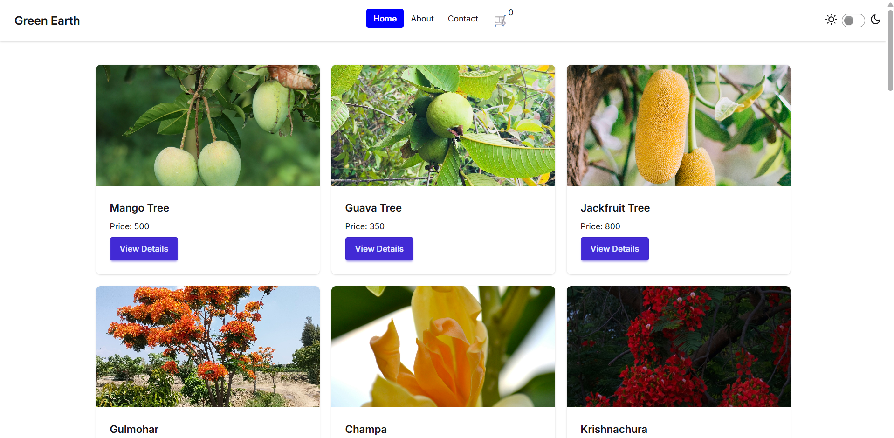
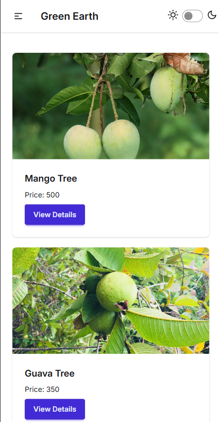

# 🌱 Plant Shop

A simple **Plant Shop web application** built with **React**.
This project allows users to explore plants, view details, and add them to their cart. It also demonstrates usage of key **React Router hooks**, **Context API**, **Axios**, and includes a **dark/light theme toggler** for better user experience.

---

## 🚀 Features

* 🛒 **Add to Cart** functionality
* 📍 **Navigation & Routing** with `react-router`
* 🔄 **useLocation, useNavigate, useNavigation** hooks in action
* 🌍 **Context API** for global state management
* 📡 **Axios** for API/data fetching
* 🌗 **Theme toggler** (Dark & Light mode)
* 📱 Responsive UI for all devices

---

## 🛠️ Tech Stack

* **React**
* **React Router v6**
* **Context API**
* **Axios**
* **Hooks (useLocation, useNavigate, useNavigation, useContext, useState, useEffect, etc.)**
* **Tailwind CSS** (if used)

---

## 📂 Project Structure

```
plant-shop/
│── src/
│   ├── components/      # Reusable components
│   ├── pages/           # Page-level components
│   ├── context/         # Context API for global state
│   ├── App.jsx          # Main App component
│   └── main.jsx         # Entry point
│── public/              # Static assets
│── package.json
│── README.md
```

---

## ⚡ Installation & Setup

1. Clone the repository:

   ```bash
   git clone <your-repo-link>
   cd plant-shop
   ```

2. Install dependencies:

   ```bash
   npm install
   ```

3. Start the development server:

   ```bash
   npm run dev
   ```

4. Open in your browser:

   ```
   http://localhost:5174
   ```

---

## 🎯 Learning Outcomes

While building this project, I practiced:

* Working with **React Router v6**
* Implementing **useLocation, useNavigate, useNavigation**
* Managing global state with **Context API**
* Fetching data using **Axios**
* Building a shopping cart system
* Handling routes and protected navigation
* Implementing a **dark/light theme toggler**

---

## 📌 Next Steps

* Add product search & filtering
* Integrate a backend API for real products
* Add authentication (login/signup)
* Improve UI/UX with animations

---

## 🤝 Contributing

Contributions, issues, and feature requests are welcome!
Feel free to fork this repo and submit a pull request.

---

## 📜 License

This project is licensed under the **MIT License**.

--
Project screenshot 
Project screenshot 
